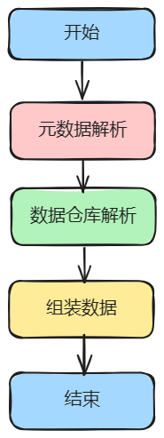

# easy-trans

一款通用的数据翻译框架

<!-- PROJECT SHIELDS -->

[![Contributors][contributors-shield]][contributors-url]
[![Forks][forks-shield]][forks-url]
[![Stargazers][stars-shield]][stars-url]
[![Issues][issues-shield]][issues-url]
[![MIT License][license-shield]][license-url]

<!-- PROJECT LOGO -->
<br />

<p align="center">
  <a href="https://github.com/orangewest/easy-trans">
    
  </a>

<h3 align="center">easy-trans</h3>
  <p align="center">
    一款通用的数据翻译框架
    <br />
    <a href="https://github.com/orangewest/easy-trans"><strong>探索本项目的文档 »</strong></a>
    <br />
    <br />
    <a href="https://github.com/orangewest/easy-trans/blob/main/easy-trans-core/src/test/java/io/github/orangewest/trans/service/TransServiceTest.java">查看Demo</a>
    ·
    <a href="https://github.com/orangewest/easy-trans/issues">报告Bug</a>
    ·
    <a href="https://github.com/orangewest/easy-trans/issues">提出新特性</a>
  </p>

</p>

## 一、架构设计

架构如下：</br>
<a href="https://github.com/orangewest/easy-trans">

</a>
</br>翻译核心注解

```java

@Retention(RetentionPolicy.RUNTIME)
@Target({ElementType.FIELD, ElementType.ANNOTATION_TYPE})
public @interface Trans {

  /**
   * @return 需要翻译的字段
   */
  String trans() default "";

  /**
   * @return 提取的字段
   */
  String key() default "";

  /**
   * @return 翻译数据获取仓库
   */
  Class<? extends TransRepository> using();

}

```

## 二、优点

1、核心源码简单，仅几百行，无任何依赖项；<br />
2、高度可拓展，拓展逻辑仅仅只需要实现TransRepository接口;<br />
3、支持数据库翻译、字典翻译、集合翻译、嵌套翻译等;<br />
4、并行翻译，翻译不同字段是并行翻译的，性能高<br />

## 三、基本使用

maven引入

```java
<dependency>
<groupId>io.github.orangewest</groupId>
<artifactId>easy-trans-core</artifactId>
<version>0.0.3</version>
</dependency>
```

比如现在有一个老师的实体对象

```java

@Data
@AllArgsConstructor
@NoArgsConstructor
public class TeacherDto {

  private Long id;

  private String name;

  // 关联教哪个学科
  private Long subjectId;

}

```

课程科目实体对象

```java

@Data
@AllArgsConstructor
@NoArgsConstructor
public class SubjectDto {

  private Long id;

  private String name;

}

```

学生实体对象

```java

@Data
public class UserDto {

  private Long id;

  private String name;

  private String sex;

  @DictTrans(trans = "sex", group = "sexDict")
  private String sexName;

  private String job;

  @DictTrans(trans = "job", group = "jobDict")
  private String jobName;

  // 关联老师id
  private Long teacherId;

  @Trans(trans = "teacherId", key = "name", using = TeacherTransRepository.class)
  private String teacherName;

  @Trans(trans = "teacherId", key = "subjectId", using = TeacherTransRepository.class)
  private Long subjectId;

  @Trans(trans = "subjectId", using = SubjectTransRepository.class, key = "name")
  private String subjectName;

  public UserDto(Long id, String name, Long teacherId, String sex, String job) {
    this.id = id;
    this.name = name;
    this.teacherId = teacherId;
    this.sex = sex;
    this.job = job;
  }
}
```

我们在teacherName 上增加@Trans的注解，<br />
其中trans 指名需要翻译哪个字段，<br />
key说明需要使用的是哪个字段，<br />
using 说明的是使用哪个数据仓库获取数据<br />
TeacherTransRepository 代码如下：

```java
public class TeacherTransRepository implements TransRepository {

  @Override
  public Map<Object, Object> getTransValueMap(List<Object> transValues, Annotation transAnno) {
    return getTeachers().stream().filter(x -> transValues.contains(x.getId())).collect(Collectors.toMap(TeacherDto::getId, x -> x));
  }

  public List<TeacherDto> getTeachers() {
    List<TeacherDto> teachers = new ArrayList<>();
    teachers.add(new TeacherDto(1L, "老师1", 1L));
    teachers.add(new TeacherDto(2L, "老师2", 2L));
    teachers.add(new TeacherDto(3L, "老师3", 3L));
    teachers.add(new TeacherDto(4L, "老师4", 4L));
    return teachers;
  }

}

```

模拟根据id查询，获取指定id的数据。
SubjectTransRepository

```java
public class SubjectTransRepository implements TransRepository {

  @Override
  public Map<Object, Object> getTransValueMap(List<Object> transValues, Annotation transAnno) {
    return getSubjects().stream().filter(x -> transValues.contains(x.getId())).collect(Collectors.toMap(SubjectDto::getId, x -> x));
  }

  public List<SubjectDto> getSubjects() {
    List<SubjectDto> subjects = new ArrayList<>();
    subjects.add(new SubjectDto(1L, "语文"));
    subjects.add(new SubjectDto(2L, "数学"));
    subjects.add(new SubjectDto(3L, "英语"));
    subjects.add(new SubjectDto(4L, "物理"));
    return subjects;
  }

}
```

注册翻译仓库：

```java
TransRepositoryFactory.register(new TeacherTransRepository());
        TransRepositoryFactory.register(new SubjectTransRepository());
        TransRepositoryFactory.register(new DictTransRepository(new DictLoader(){
@Override
public Map<String, String> loadDict(String dictGroup){
        return dictMap().getOrDefault(dictGroup,new HashMap<>());
        }

private Map<String, Map<String, String>>dictMap(){
        Map<String, Map<String, String>>map=new HashMap<>();
        map.put("sexDict",new HashMap<>());
        map.put("jobDict",new HashMap<>());
        map.get("sexDict").put("1","男");
        map.get("sexDict").put("2","女");
        map.get("jobDict").put("1","学习委员");
        map.get("jobDict").put("2","生活委员");
        map.get("jobDict").put("3","宣传委员");
        map.get("jobDict").put("4","班长");
        map.get("jobDict").put("5","团支书");
        map.get("jobDict").put("6","团长");
        return map;
        }

        }));
```

代码测试：

```java
@Test
void trans(){
        UserDto userDto=new UserDto(1L,"张三",2L,"1","2");
        System.out.println("翻译前："+userDto);
        transService.trans(userDto);
        System.out.println("翻译后："+userDto);
        List<UserDto> userDtoList=new ArrayList<>();
        UserDto userDto2=new UserDto(2L,"李四",1L,"2","1");
        UserDto userDto3=new UserDto(3L,"王五",2L,"1","3");
        UserDto userDto4=new UserDto(4L,"赵六",3L,"2","4");
        userDtoList.add(userDto4);
        userDtoList.add(userDto3);
        userDtoList.add(userDto2);
        System.out.println("翻译前："+userDtoList);
        transService.trans(userDtoList);
        System.out.println("翻译后："+userDtoList);

        }
```

结果输出

```java
翻译前：UserDto(id=1,name=张三,sex=1,sexName=null,job=2,jobName=null,teacherId=2,teacherName=null,subjectId=null,subjectName=null)
        翻译后：UserDto(id=1,name=张三,sex=1,sexName=男,job=2,jobName=生活委员,teacherId=2,teacherName=老师2,subjectId=2,subjectName=数学)
        翻译前：[UserDto(id=4,name=赵六,sex=2,sexName=null,job=4,jobName=null,teacherId=3,teacherName=null,subjectId=null,subjectName=null),UserDto(id=3,name=王五,sex=1,sexName=null,job=3,jobName=null,teacherId=2,teacherName=null,subjectId=null,subjectName=null),UserDto(id=2,name=李四,sex=2,sexName=null,job=1,jobName=null,teacherId=1,teacherName=null,subjectId=null,subjectName=null)]
        翻译后：[UserDto(id=4,name=赵六,sex=2,sexName=女,job=4,jobName=班长,teacherId=3,teacherName=老师3,subjectId=3,subjectName=英语),UserDto(id=3,name=王五,sex=1,sexName=男,job=3,jobName=宣传委员,teacherId=2,teacherName=老师2,subjectId=2,subjectName=数学),UserDto(id=2,name=李四,sex=2,sexName=女,job=1,jobName=学习委员,teacherId=1,teacherName=老师1,subjectId=1,subjectName=语文)]
```

## 四、高级功能

### 1、自定义注解

使用@Trans注解标注在自定义注解上即可，自定义注解中需要有trans方法。
示例：

```java

@Retention(RetentionPolicy.RUNTIME)
@Target({ElementType.FIELD})
// 使用@Trans标注
@Trans(using = TeacherTransRepository.class)
public @interface TeacherTrans {

  /**
   * 需要翻译的字段
   */
  String trans() default "";

  /**
   * key 提取的字段
   */
  String key() default "";

}

```

```java

@Data
public class UserDto2 {

  private Long id;

  private String name;

  private List<Long> teacherIds;

  private List<String> jobIds;

  @DictTrans(trans = "jobIds", group = "jobDict")
  private List<String> jobNames;

  @TeacherTrans(trans = "teacherIds", key = "name")
  private List<String> teacherName;

  @TeacherTrans(trans = "teacherIds", key = "subjectId")
  private List<Long> subjectIds;

  @Trans(using = SubjectTransRepository.class, trans = "subjectIds", key = "name")
  private List<String> subjectNames;

  public UserDto2(Long id, String name, List<Long> teacherIds, List<String> jobIds) {
    this.id = id;
    this.name = name;
    this.teacherIds = teacherIds;
    this.jobIds = jobIds;
  }
}

```

测试

```java
@Test
void trans2(){
        List<Long> teacherIds=new ArrayList<>();
        teacherIds.add(1L);
        teacherIds.add(2L);
        List<String> jobIds=new ArrayList<>();
        jobIds.add("1");
        jobIds.add("2");
        UserDto2 userDto=new UserDto2(1L,"张三",teacherIds,jobIds);
        System.out.println("翻译前："+userDto);
        transService.trans(userDto);
        System.out.println("翻译后："+userDto);
        List<UserDto2> userDtoList=new ArrayList<>();
        UserDto2 userDto2=new UserDto2(2L,"李四",teacherIds,jobIds);
        List<Long> teacherIds2=new ArrayList<>();
        teacherIds2.add(3L);
        teacherIds2.add(4L);
        List<String> jobIds2=new ArrayList<>();
        jobIds2.add("3");
        jobIds2.add("4");
        UserDto2 userDto3=new UserDto2(3L,"王五",teacherIds2,jobIds2);
        UserDto2 userDto4=new UserDto2(4L,"赵六",teacherIds2,jobIds2);
        userDtoList.add(userDto4);
        userDtoList.add(userDto3);
        userDtoList.add(userDto2);
        System.out.println("翻译前："+userDtoList);
        transService.trans(userDtoList);
        System.out.println("翻译后："+userDtoList);
        }

```

结果输出

```java
翻译前：UserDto2(id=1,name=张三,teacherIds=[1,2],jobIds=[1,2],jobNames=null,teacherName=null,subjectIds=null,subjectNames=null)
        翻译后：UserDto2(id=1,name=张三,teacherIds=[1,2],jobIds=[1,2],jobNames=[学习委员,生活委员],teacherName=[老师1,老师2],subjectIds=[1,2],subjectNames=[语文,数学])
        翻译前：[UserDto2(id=4,name=赵六,teacherIds=[3,4],jobIds=[3,4],jobNames=null,teacherName=null,subjectIds=null,subjectNames=null),UserDto2(id=3,name=王五,teacherIds=[3,4],jobIds=[3,4],jobNames=null,teacherName=null,subjectIds=null,subjectNames=null),UserDto2(id=2,name=李四,teacherIds=[1,2],jobIds=[1,2],jobNames=null,teacherName=null,subjectIds=null,subjectNames=null)]
        翻译后：[UserDto2(id=4,name=赵六,teacherIds=[3,4],jobIds=[3,4],jobNames=[宣传委员,班长],teacherName=[老师3,老师4],subjectIds=[3,4],subjectNames=[英语,物理]),UserDto2(id=3,name=王五,teacherIds=[3,4],jobIds=[3,4],jobNames=[宣传委员,班长],teacherName=[老师3,老师4],subjectIds=[3,4],subjectNames=[英语,物理]),UserDto2(id=2,name=李四,teacherIds=[1,2],jobIds=[1,2],jobNames=[学习委员,生活委员],teacherName=[老师1,老师2],subjectIds=[1,2],subjectNames=[语文,数学])]
```

### 2、值提取

有些翻译类型匹配结果的时候是通过值去匹配的，比如说字典翻译，我们需要根据字典值去字典组里面去匹配数据，框架里面只需要标记key的值用#val即可实现，比如框架自带的@DictTrans注解。

```java

@Trans(using = DictTransRepository.class, key = "#val")
@Retention(RetentionPolicy.RUNTIME)
@Target(ElementType.FIELD)
public @interface DictTrans {


  /**
   * @return 需要翻译的字段
   */
  String trans();

  /**
   * 字典组
   *
   * @return 字典分组
   */
  String group();

}

```

### 3、包装类翻译

有些类是包装类，比如返回的结果，返回的分页对象等，需要翻译的数据一般都是里面的实际业务对象，这时候，需要我们去配置解析包装类的解析器。
示例：

```java

@Data
@AllArgsConstructor
public class Result<T> {

  private T data;

  private String message;

}

```

配置解析器，实现TransObjResolver接口即可

```java
public class ResultResolver implements TransObjResolver {
  @Override
  public boolean support(Object obj) {
    return obj instanceof Result;
  }

  @Override
  public Object resolveTransObj(Object obj) {
    return ((Result<?>) obj).getData();
  }

}

```

```java
TransObjResolverFactory.register(new ResultResolver());
```

测试：

```java
@Test
void trans3(){
        List<Long> teacherIds=new ArrayList<>();
        teacherIds.add(1L);
        teacherIds.add(2L);
        List<String> jobIds=new ArrayList<>();
        jobIds.add("1");
        jobIds.add("2");
        jobIds.add("3");
        UserDto2 userDto=new UserDto2(1L,"张三",teacherIds,jobIds);
        Result<UserDto2> result=new Result<>(userDto,"success");
        System.out.println("翻译前："+result);
        transService.trans(result);
        System.out.println("翻译后："+result);
        UserDto2 userDto2=new UserDto2(2L,"李四",teacherIds,jobIds);
        Result<UserDto2> result2=new Result<>(userDto2,"success");
        Result<Result<UserDto2>>result3=new Result<>(result2,"success");
        System.out.println("翻译前："+result3);
        transService.trans(result3);
        System.out.println("翻译后："+result3);
        }

```

结果输出：

```java
翻译前：Result(data=UserDto2(id=1,name=张三,teacherIds=[1,2],jobIds=[1,2,3],jobNames=null,teacherName=null,subjectIds=null,subjectNames=null),message=success)
        翻译后：Result(data=UserDto2(id=1,name=张三,teacherIds=[1,2],jobIds=[1,2,3],jobNames=[学习委员,生活委员,宣传委员],teacherName=[老师1,老师2],subjectIds=[1,2],subjectNames=[语文,数学]),message=success)
        翻译前：Result(data=Result(data=UserDto2(id=2,name=李四,teacherIds=[1,2],jobIds=[1,2,3],jobNames=null,teacherName=null,subjectIds=null,subjectNames=null),message=success),message=success)
        翻译后：Result(data=Result(data=UserDto2(id=2,name=李四,teacherIds=[1,2],jobIds=[1,2,3],jobNames=[学习委员,生活委员,宣传委员],teacherName=[老师1,老师2],subjectIds=[1,2],subjectNames=[语文,数学]),message=success),message=success)
```

### 4、与springboot集成

maven 引入

```java
<dependency>
<groupId>io.github.orangewest</groupId>
<artifactId>easy-trans-spring-start</artifactId>
<version>0.0.3</version>
</dependency>
```

翻译仓库实现TransRepository，翻译解析器实现TransObjResolver，并在实现类上标注@Component；
在需要翻译的对象属性上面标注好相关注解；
需要翻译方法上使用@AutoTrans注解，框架会自动拦截需要翻译的对象，实现翻译。

```java
@GetMapping("/query")
@AutoTrans
public Result<PageData<BizDTO>>page(Query query){
        PageData<BizDTO> page=bizService.page(query);

        return new Result<PageData<BizDTO>>().ok(page);
        }

```

### 5、与orm框架集成

通常很多翻译需求，都是根据id去查询实体对象，我们可以通过orm框架对此进行统一翻译
示例：
与mybatis-plus集成
定义翻译注解

```java

@Retention(RetentionPolicy.RUNTIME)
@Target({ElementType.FIELD})
@Trans(using = DbTransRepository.class)
public @interface DbTrans {

  String trans();

  String key() default "";

  /**
   * 数据库目标class
   */
  Class<? extends BaseEntity> entity() default BaseEntity.class;

}

```

翻译仓库实现

```java

@Component
public class DbTransRepository implements TransRepository {

  @Resource
  private TransDriver transDriver;

  @Override
  public Map<Object, Object> getTransValueMap(List<Object> transValues, Annotation transAnno) {
    if (transAnno instanceof DbTrans) {
      DbTrans dbTrans = (DbTrans) transAnno;
      List<? extends BaseEntity> entities = transDriver.findByIds(getIds(transValues), dbTrans.entity());
      return entities.stream().collect(Collectors.toMap(BaseEntity::getId, x -> x));
    }
    return Collections.emptyMap();
  }

  /**
   * 获取查询id
   */
  private List<Long> getIds(List<Object> transValues) {
    return transValues.stream()
            .map(x -> (Long) x)
            .collect(Collectors.toList());
  }

}

```

```java
public interface TransDriver {

  /**
   * 根据ids获取集合
   *
   * @param ids         ids
   * @param targetClass 目标类类名
   */
  List<? extends BaseEntity> findByIds(List<? extends Serializable> ids, Class<? extends BaseEntity> targetClass);

}
```

```java

@Component
public class MybatisTransDriver implements TransDriver {

  @Override
  public List<? extends BaseEntity> findByIds(List<? extends Serializable> ids, Class<? extends BaseEntity> targetClass) {
    try (SqlSession sqlSession = SqlHelper.sqlSession(targetClass)) {
      BaseMapper<? extends BaseEntity> mapper = SqlHelper.getMapper(targetClass, sqlSession);
      return mapper.selectBatchIds(ids);
    }
  }

}
```

<!-- links -->

[your-project-path]:orangewest/easy-trans

[contributors-shield]: https://img.shields.io/github/contributors/orangewest/easy-trans.svg?style=flat-square

[contributors-url]: https://github.com/orangewest/easy-trans/graphs/contributors

[forks-shield]: https://img.shields.io/github/forks/orangewest/easy-trans.svg?style=flat-square

[forks-url]: https://github.com/orangewest/easy-trans/network/members

[stars-shield]: https://img.shields.io/github/stars/orangewest/easy-trans.svg?style=flat-square

[stars-url]: https://github.com/orangewest/easy-trans/stargazers

[issues-shield]: https://img.shields.io/github/issues/orangewest/easy-trans.svg?style=flat-square

[issues-url]: https://img.shields.io/github/issues/orangewest/easy-trans.svg

[license-shield]: https://img.shields.io/github/license/orangewest/easy-trans.svg?style=flat-square

[license-url]: https://github.com/orangewest/easy-trans/blob/master/LICENSE.txt


