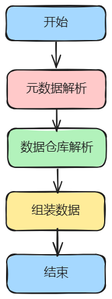

# easy-trans

一款通用的数据翻译框架

<!-- PROJECT SHIELDS -->

[![Contributors][contributors-shield]][contributors-url]
[![Forks][forks-shield]][forks-url]
[![Stargazers][stars-shield]][stars-url]
[![Issues][issues-shield]][issues-url]
[![MIT License][license-shield]][license-url]

<!-- PROJECT LOGO -->

<br />

<p align="center">
  <a href="https://github.com/orangewest/easy-trans">
    
  </a>

<h3 align="center">easy-trans</h3>
  <p align="center">
    一款通用的数据翻译框架
    <br />
    <a href="https://github.com/orangewest/easy-trans"><strong>探索本项目的文档 »</strong></a>
    <br />
    <br />
    <a href="https://github.com/orangewest/easy-trans/blob/main/easy-trans-core/src/test/java/io/github/orangewest/trans/service/TransServiceTest.java">查看Demo</a>
    ·
    <a href="https://github.com/orangewest/easy-trans/issues">报告Bug</a>
    ·
    <a href="https://github.com/orangewest/easy-trans/issues">提出新特性</a>
  </p>

</p>

## 一、架构设计

架构如下：</br>
<a href="https://github.com/orangewest/easy-trans">

</a>
</br>翻译核心注解

```java

@Retention(RetentionPolicy.RUNTIME)
@Target({ElementType.FIELD})
public @interface Trans {

    /**
     * @return 需要获取数据的仓库（或字段）
     */
    String trans();

    /**
     * @return 从仓库中提取的字段
     */
    String key() default "";

    /**
     * @return 翻译数据获取仓库
     */
    Class<? extends TransRepository<?, ?>>[] using() default {};

}

```

</br>翻译仓库

```java
public interface TransRepository<T, R> {

    /**
     * 获取翻译结果（适用于数据库等翻译）
     *
     * @param transValues 需要翻译的值
     * @param transAnno   翻译对象上的注解
     * @return 查询结果值 val-翻译值
     */
    Map<T, R> getTransValueMap(List<T> transValues, Annotation transAnno);

}
```

</br>翻译仓库注解

```java

@Retention(RetentionPolicy.RUNTIME)
@Target({ElementType.FIELD, ElementType.ANNOTATION_TYPE, ElementType.TYPE})
@Repeatable(TransRepos.class)
public @interface TransRepo {

    /**
     * @return 仓库名称（默认使用字段名）
     */
    String name() default "";

    /**
     * @return 翻译数据获取仓库
     */
    Class<? extends TransRepository<?, ?>> using();
}
```

## 二、优点

1、核心源码简单，仅几百行，无任何依赖项；<br />
2、高度可拓展，拓展逻辑仅仅只需要实现TransRepository接口；<br />
3、支持数据库翻译、字典翻译、集合翻译、嵌套翻译等；<br />
4、并行翻译，翻译不同字段是并行翻译的，性能高<br />

## 三、基本使用

maven引入

```xml

<dependency>
    <groupId>io.github.orangewest</groupId>
    <artifactId>easy-trans-core</artifactId>
    <version>0.2.0</version>
</dependency>
```

比如现在有一个老师的实体对象

```java

@Data
@AllArgsConstructor
@NoArgsConstructor
public class TeacherDto {

    private Long id;

    private String name;

    // 关联教哪个学科
    private Long subjectId;

}

```

课程科目实体对象

```java

@Data
@AllArgsConstructor
@NoArgsConstructor
public class SubjectDto {

    private Long id;

    private String name;

}

```

学生实体对象

```java
@Data
public class UserDto {

    private Long id;

    private String name;

    @DictTransRepo(group = "sexDict")
    private String sex;

    @Trans(trans = "sex")
    private String sexName;

    @DictTransRepo(group = "jobDict")
    private String job;

    @Trans(trans = "job")
    private String jobName;

    @TransRepo(using = TeacherTransRepository.class)
    private Long teacherId;

    @Trans(trans = "teacherId", key = "name")
    private String teacherName;

    @TransRepo(using = SubjectTransRepository.class)
    @Trans(trans = "teacherId", key = "subjectId")
    private Long subjectId;

    @Trans(trans = "subjectId", key = "name")
    private String subjectName;

    private String deptCode;

    @Trans(trans = "deptCode", key = "name", using = DeptTransRepository.class)
    private String deptName;

    public UserDto(Long id, String name, Long teacherId, String sex, String job, String deptCode) {
        this.id = id;
        this.name = name;
        this.teacherId = teacherId;
        this.sex = sex;
        this.job = job;
        this.deptCode = deptCode;
    }
}
```

**1、定义翻译仓库**</br>
我们在teacherId上增加@TransRepo注解，using 说明的是使用哪个数据仓库获取数据</br>
**2、定义提取字段**</br>
然后我们在teacherName上增加@Trans的注解；</br>
其中trans 指的是从哪个仓库获取数据，key说明需要从仓库中提取的哪个字段；</br>
其他字段同理；</br>
也可以直接在@Trans注解上使用using指定翻译仓库，这个时候会使用这个仓库进行翻译；</br>

TeacherTransRepository 代码如下：

```java
public class TeacherTransRepository implements TransRepository<Long, TeacherDto> {

    @Override
    public Map<Long, TeacherDto> getTransValueMap(List<Long> transValues, Annotation transAnno) {
        return getTeachers().stream()
                .filter(x -> transValues.contains(x.getId()))
                .collect(Collectors.toMap(TeacherDto::getId, x -> x));
    }

    public List<TeacherDto> getTeachers() {
        List<TeacherDto> teachers = new ArrayList<>();
        teachers.add(new TeacherDto(1L, "老师1", 1L));
        teachers.add(new TeacherDto(2L, "老师2", 2L));
        teachers.add(new TeacherDto(3L, "老师3", 3L));
        teachers.add(new TeacherDto(4L, "老师4", 4L));
        return teachers;
    }

}


```

模拟根据id查询，获取指定id的数据。
SubjectTransRepository

```java
public class SubjectTransRepository implements TransRepository<Long, SubjectDto> {

    @Override
    public Map<Long, SubjectDto> getTransValueMap(List<Long> transValues, Annotation transAnno) {
        return getSubjects().stream()
                .filter(x -> transValues.contains(x.getId()))
                .collect(Collectors.toMap(SubjectDto::getId, x -> x));
    }

    public List<SubjectDto> getSubjects() {
        List<SubjectDto> subjects = new ArrayList<>();
        subjects.add(new SubjectDto(1L, "语文"));
        subjects.add(new SubjectDto(2L, "数学"));
        subjects.add(new SubjectDto(3L, "英语"));
        subjects.add(new SubjectDto(4L, "物理"));
        return subjects;
    }

}
```

注册翻译仓库：

```java
    @BeforeAll
public static void before() {
    TransRepositoryFactory.register(new TeacherTransRepository());
    TransRepositoryFactory.register(new TeacherTrans2Repository());
    TransRepositoryFactory.register(new SubjectTransRepository());
    TransRepositoryFactory.register(new DeptTransRepository());
    TransRepositoryFactory.register(new TeacherAndSubjectTransRepository());
    TransRepositoryFactory.register(new CityTransRepository());
    TransRepositoryFactory.register(new DictTransRepository(new DictLoader() {
@Override
public Map<String, String> loadDict(String dictGroup) {
        return dictMap().getOrDefault(dictGroup, new HashMap<>());
    }

private Map<String, Map<String, String>> dictMap() {
        Map<String, Map<String, String>> map = new HashMap<>();
        map.put("sexDict", new HashMap<>());
        map.put("jobDict", new HashMap<>());
        map.get("sexDict").put("1", "男");
        map.get("sexDict").put("2", "女");
        map.get("jobDict").put("1", "学习委员");
        map.get("jobDict").put("2", "生活委员");
        map.get("jobDict").put("3", "宣传委员");
        map.get("jobDict").put("4", "班长");
        map.get("jobDict").put("5", "团支书");
        map.get("jobDict").put("6", "团长");
        return map;
    }

    }));
    TransObjResolverFactory.register(new ResultResolver());
}

```

代码测试：

```java
@Test
void trans1(){
    UserDto userDto=new UserDto(1L,"张三",2L,"1","2","1");
    System.out.println("翻译前："+userDto);
    transService.trans(userDto);
    System.out.println("翻译后："+userDto);
    Assertions.assertEquals("男",userDto.getSexName());
    Assertions.assertEquals("生活委员",userDto.getJobName());
    Assertions.assertEquals("老师2",userDto.getTeacherName());
    Assertions.assertEquals("数学",userDto.getSubjectName());
    List<UserDto> userDtoList=new ArrayList<>();
    UserDto userDto2=new UserDto(2L,"李四",1L,"2","1","1");
    UserDto userDto3=new UserDto(3L,"王五",2L,"1","3","2");
    UserDto userDto4=new UserDto(4L,"赵六",3L,"2","4","2");
    userDtoList.add(userDto4);
    userDtoList.add(userDto3);
    userDtoList.add(userDto2);
    System.out.println("翻译前："+userDtoList);
    transService.trans(userDtoList);
    System.out.println("翻译后："+userDtoList);
}
```

结果输出

```java
翻译前：UserDto(id=1,name=张三,sex=1,sexName=null,job=2,jobName=null,teacherId=2,teacherName=null,subjectId=null,subjectName=null,deptCode=1,deptName=null)
翻译后：UserDto(id=1,name=张三,sex=1,sexName=男,job=2,jobName=生活委员,teacherId=2,teacherName=老师2,subjectId=2,subjectName=数学,deptCode=1,deptName=部门1)
翻译前：[UserDto(id=4,name=赵六,sex=2,sexName=null,job=4,jobName=null,teacherId=3,teacherName=null,subjectId=null,subjectName=null,deptCode=2,deptName=null),UserDto(id=3,name=王五,sex=1,sexName=null,job=3,jobName=null,teacherId=2,teacherName=null,subjectId=null,subjectName=null,deptCode=2,deptName=null),UserDto(id=2,name=李四,sex=2,sexName=null,job=1,jobName=null,teacherId=1,teacherName=null,subjectId=null,subjectName=null,deptCode=1,deptName=null)]
翻译后：[UserDto(id=4,name=赵六,sex=2,sexName=女,job=4,jobName=班长,teacherId=3,teacherName=老师3,subjectId=3,subjectName=英语,deptCode=2,deptName=部门2),UserDto(id=3,name=王五,sex=1,sexName=男,job=3,jobName=宣传委员,teacherId=2,teacherName=老师2,subjectId=2,subjectName=数学,deptCode=2,deptName=部门2),UserDto(id=2,name=李四,sex=2,sexName=女,job=1,jobName=学习委员,teacherId=1,teacherName=老师1,subjectId=1,subjectName=语文,deptCode=1,deptName=部门1)]
```

## 四、高级功能

### 1、自定义注解

使用@TransRepo注解标注在自定义注解上即可，比如框架自带的字典翻译@DictTransRepo
示例：

```java

@Retention(RetentionPolicy.RUNTIME)
@Target({ElementType.FIELD})
@TransRepo(using = TeacherTransRepository.class)
public @interface TeacherTransRepo {

    String name() default "";

}

```

```java

@Data
public class UserDto2 {

    private Long id;

    private String name;


    @TeacherTransRepo
    private List<Long> teacherIds;

    @DictTransRepo(group = "jobDict")
    private List<String> jobIds;

    @Trans(trans = "jobIds")
    private List<String> jobNames;

    @Trans(trans = "teacherIds", key = "name")
    private List<String> teacherName;

    @Trans(trans = "teacherIds", key = "subjectId")
    @TransRepo(using = SubjectTransRepository.class)
    private List<Long> subjectIds;

    @Trans(trans = "subjectIds", key = "name")
    private List<String> subjectNames;

    public UserDto2(Long id, String name, List<Long> teacherIds, List<String> jobIds) {
        this.id = id;
        this.name = name;
        this.teacherIds = teacherIds;
        this.jobIds = jobIds;
    }
}
```

测试

```java
@Test
void trans2() {
    List<Long> teacherIds=new ArrayList<>();
    teacherIds.add(1L);
    teacherIds.add(2L);
    List<String> jobIds=new ArrayList<>();
    jobIds.add("1");
    jobIds.add("2");
    UserDto2 userDto=new UserDto2(1L,"张三",teacherIds,jobIds);
    System.out.println("翻译前："+userDto);
    transService.trans(userDto);
    System.out.println("翻译后："+userDto);
    List<UserDto2> userDtoList=new ArrayList<>();
    UserDto2 userDto2=new UserDto2(2L,"李四",teacherIds,jobIds);
    List<Long> teacherIds2=new ArrayList<>();
    teacherIds2.add(3L);
    teacherIds2.add(4L);
    List<String> jobIds2=new ArrayList<>();
    jobIds2.add("3");
    jobIds2.add("4");
    UserDto2 userDto3=new UserDto2(3L,"王五",teacherIds2,jobIds2);
    UserDto2 userDto4=new UserDto2(4L,"赵六",teacherIds2,jobIds2);
    userDtoList.add(userDto4);
    userDtoList.add(userDto3);
    userDtoList.add(userDto2);
    System.out.println("翻译前："+userDtoList);
    transService.trans(userDtoList);
    System.out.println("翻译后："+userDtoList);
}

```

结果输出

```java
翻译前：UserDto2(id=1,name=张三,teacherIds=[1,2],jobIds=[1,2],jobNames=null,teacherName=null,subjectIds=null,subjectNames=null)
翻译后：UserDto2(id=1,name=张三,teacherIds=[1,2],jobIds=[1,2],jobNames=[学习委员,生活委员],teacherName=[老师1,老师2],subjectIds=[1,2],subjectNames=[语文,数学])
翻译前：[UserDto2(id=4,name=赵六,teacherIds=[3,4],jobIds=[3,4],jobNames=null,teacherName=null,subjectIds=null,subjectNames=null),UserDto2(id=3,name=王五,teacherIds=[3,4],jobIds=[3,4],jobNames=null,teacherName=null,subjectIds=null,subjectNames=null),UserDto2(id=2,name=李四,teacherIds=[1,2],jobIds=[1,2],jobNames=null,teacherName=null,subjectIds=null,subjectNames=null)]
翻译后：[UserDto2(id=4,name=赵六,teacherIds=[3,4],jobIds=[3,4],jobNames=[宣传委员,班长],teacherName=[老师3,老师4],subjectIds=[3,4],subjectNames=[英语,物理]),UserDto2(id=3,name=王五,teacherIds=[3,4],jobIds=[3,4],jobNames=[宣传委员,班长],teacherName=[老师3,老师4],subjectIds=[3,4],subjectNames=[英语,物理]),UserDto2(id=2,name=李四,teacherIds=[1,2],jobIds=[1,2],jobNames=[学习委员,生活委员],teacherName=[老师1,老师2],subjectIds=[1,2],subjectNames=[语文,数学])]
```

### 2、嵌套翻译

本框架支持多层嵌套翻译，比如翻译省市区，只要按翻译逻辑顺序定义好就行</br>
示例：

```java

@Data
public class CityDto {

    @TransRepo(using = CityTransRepository.class)
    private Long areaId;

    @Trans(trans = "areaId", key = "name", using = CityTransRepository.class)
    private String areaName;

    @Trans(trans = "areaId", key = "pid", using = CityTransRepository.class)
    @TransRepo(using = CityTransRepository.class)
    private Long cityId;

    @Trans(trans = "cityId", key = "name")
    private String cityName;

    @Trans(trans = "cityId", key = "pid")
//    @TransRepo(using = CityTransRepository.class)
    private Long provinceId;

    @Trans(trans = "provinceId", key = "name", using = CityTransRepository.class)
    private String provinceName;


    public CityDto(Long areaId) {
        this.areaId = areaId;
    }

}
```

```java
public class CityTransRepository implements TransRepository<Long, CityEntity> {

    @Override
    public Map<Long, CityEntity> getTransValueMap(List<Long> transValues, Annotation transAnno) {
        return data().stream()
                .filter(x -> transValues.contains(x.getId()))
                .collect(Collectors.toMap(CityEntity::getId, x -> x));
    }

    private List<CityEntity> data() {
        List<CityEntity> cityEntities = new ArrayList<>();
        cityEntities.add(new CityEntity(1L, "湖南省", 0L));
        cityEntities.add(new CityEntity(2L, "长沙市", 1L));
        cityEntities.add(new CityEntity(3L, "株洲市", 1L));
        cityEntities.add(new CityEntity(4L, "湘潭市", 1L));
        cityEntities.add(new CityEntity(5L, "雨花区", 2L));
        cityEntities.add(new CityEntity(6L, "岳麓区", 2L));
        cityEntities.add(new CityEntity(7L, "长沙县", 2L));
        cityEntities.add(new CityEntity(8L, "测试县", 10L));
        return cityEntities;
    }

}

@Data
@AllArgsConstructor
public class CityEntity {

    private Long id;

    private String name;

    private Long pid;

}

```

测试代码：

```java
@Test
void trans6(){
    CityDto cityDto=new CityDto(7L);
    System.out.println("翻译前："+cityDto);
    transService.trans(cityDto);
    System.out.println("翻译后："+cityDto);
    Assertions.assertEquals("长沙县",cityDto.getAreaName());
    Assertions.assertEquals("长沙市",cityDto.getCityName());
    Assertions.assertEquals("湖南省",cityDto.getProvinceName());
    List<CityDto> cityDtoList=new ArrayList<>();
    cityDtoList.add(new CityDto(7L));
    cityDtoList.add(new CityDto(8L));
    System.out.println("翻译前："+cityDtoList);
    transService.trans(cityDtoList);
    System.out.println("翻译后："+cityDtoList);
    Assertions.assertEquals("长沙县",cityDtoList.get(0).getAreaName());
    Assertions.assertEquals("长沙市",cityDtoList.get(0).getCityName());
    Assertions.assertEquals("湖南省",cityDtoList.get(0).getProvinceName());
    Assertions.assertEquals("测试县",cityDtoList.get(1).getAreaName());
    Assertions.assertNull(cityDtoList.get(1).getCityName());
    Assertions.assertNull(cityDtoList.get(1).getProvinceName());
}

```

翻译结果如下：

```java
翻译前：CityDto(areaId=7,areaName=null,cityId=null,cityName=null,provinceId=null,provinceName=null)
翻译后：CityDto(areaId=7,areaName=长沙县,cityId=2,cityName=长沙市,provinceId=1,provinceName=湖南省)
翻译前：[CityDto(areaId=7,areaName=null,cityId=null,cityName=null,provinceId=null,provinceName=null),CityDto(areaId=8,areaName=null,cityId=null,cityName=null,provinceId=null,provinceName=null)]
翻译后：[CityDto(areaId=7,areaName=长沙县,cityId=2,cityName=长沙市,provinceId=1,provinceName=湖南省),CityDto(areaId=8,areaName=测试县,cityId=10,cityName=null,provinceId=null,provinceName=null)]
```

### 3、包装类翻译

有些类是包装类，比如返回的结果，返回的分页对象等，需要翻译的数据一般都是里面的实际业务对象，这时候，需要我们去配置解析包装类的解析器。
示例：

```java

@Data
@AllArgsConstructor
public class Result<T> {

    private T data;

    private String message;

}

```

配置解析器，实现TransObjResolver接口即可

```java
public class ResultResolver implements TransObjResolver {

    @Override
    public boolean support(Object obj) {
        return obj instanceof Result;
    }

    @Override
    public Object resolveTransObj(Object obj) {
        return ((Result<?>) obj).getData();
    }

}

```

```java
TransObjResolverFactory.register(new ResultResolver());
```

测试：

```java
@Test
void trans3() {
    List<Long> teacherIds=new ArrayList<>();
    teacherIds.add(1L);
    teacherIds.add(2L);
    List<String> jobIds=new ArrayList<>();
    jobIds.add("1");
    jobIds.add("2");
    jobIds.add("3");
    UserDto2 userDto=new UserDto2(1L,"张三",teacherIds,jobIds);
    Result<UserDto2> result=new Result<>(userDto,"success");
    System.out.println("翻译前："+result);
    transService.trans(result);
    System.out.println("翻译后："+result);
    UserDto2 userDto2=new UserDto2(2L,"李四",teacherIds,jobIds);
    Result<UserDto2> result2=new Result<>(userDto2,"success");
    Result<Result<UserDto2>>result3=new Result<>(result2,"success");
    System.out.println("翻译前："+result3);
    transService.trans(result3);
    System.out.println("翻译后："+result3);
}

```

结果输出：

```java
翻译前：Result(data=UserDto2(id=1,name=张三,teacherIds=[1,2],jobIds=[1,2,3],jobNames=null,teacherName=null,subjectIds=null,subjectNames=null),message=success)
翻译后：Result(data=UserDto2(id=1,name=张三,teacherIds=[1,2],jobIds=[1,2,3],jobNames=[学习委员,生活委员,宣传委员],teacherName=[老师1,老师2],subjectIds=[1,2],subjectNames=[语文,数学]),message=success)
翻译前：Result(data=Result(data=UserDto2(id=2,name=李四,teacherIds=[1,2],jobIds=[1,2,3],jobNames=null,teacherName=null,subjectIds=null,subjectNames=null),message=success),message=success)
翻译后：Result(data=Result(data=UserDto2(id=2,name=李四,teacherIds=[1,2],jobIds=[1,2,3],jobNames=[学习委员,生活委员,宣传委员],teacherName=[老师1,老师2],subjectIds=[1,2],subjectNames=[语文,数学]),message=success),message=success)
```

### 4、对象直接填充

有时候我们可能需要把完整的对象填充到需要翻译的字段中，只需要返回类型和需要翻译的字段的类型一致，框架会自动填充。

```java

@Data
public class UserDto3 {

    private Long id;

    private String name;

    @TeacherTransRepo
    @TransRepo(name = "teacherId1", using = TeacherTrans2Repository.class)
    private Long teacherId;

    @Trans(trans = "teacherId")
    private TeacherDto teacher;

    @Trans(trans = "teacherId1")
    private boolean isYuwenTeacher;

    @Trans(trans = "teacherId", using = TeacherTrans2Repository.class)
    private Boolean isYuwenTeacher2;

    public UserDto3(Long id, String name, Long teacherId) {
        this.id = id;
        this.name = name;
        this.teacherId = teacherId;
    }
}

```

```java
public class TeacherTrans2Repository implements TransRepository<Long, Boolean> {

    @Override
    public Map<Long, Boolean> getTransValueMap(List<Long> transValues, Annotation transAnno) {
        return getTeachers().stream()
                .filter(x -> transValues.contains(x.getId()))
                .collect(Collectors.toMap(TeacherDto::getId, x -> x.getSubjectId() == 1));
    }

    public List<TeacherDto> getTeachers() {
        List<TeacherDto> teachers = new ArrayList<>();
        teachers.add(new TeacherDto(1L, "老师1", 1L));
        teachers.add(new TeacherDto(2L, "老师2", 2L));
        teachers.add(new TeacherDto(3L, "老师3", 3L));
        teachers.add(new TeacherDto(4L, "老师4", 4L));
        return teachers;
    }

}
```

```java
@Test
void trans4(){
    UserDto3 userDto=new UserDto3(1L,"张三",1L);
    System.out.println("翻译前："+userDto);
    transService.trans(userDto);
    System.out.println("翻译后："+userDto);
    Assertions.assertNotNull(userDto.getTeacher());
    Assertions.assertEquals("老师1",userDto.getTeacher().getName());
    Assertions.assertTrue(userDto.isYuwenTeacher());
    Assertions.assertTrue(userDto.getIsYuwenTeacher2());
    List<UserDto3> userDtoList=new ArrayList<>();
    UserDto3 userDto2=new UserDto3(2L,"李四",1L);
    UserDto3 userDto3=new UserDto3(3L,"王五",2L);
    UserDto3 userDto4=new UserDto3(4L,"赵六",3L);
    userDtoList.add(userDto2);
    userDtoList.add(userDto3);
    userDtoList.add(userDto4);
    System.out.println("翻译前："+userDtoList);
    transService.trans(userDtoList);
    System.out.println("翻译后："+userDtoList);
    Assertions.assertNotNull(userDtoList.get(0).getTeacher());
    Assertions.assertEquals("老师1",userDtoList.get(0).getTeacher().getName());
    Assertions.assertTrue(userDtoList.get(0).isYuwenTeacher());
    Assertions.assertTrue(userDtoList.get(0).getIsYuwenTeacher2());
    Assertions.assertNotNull(userDtoList.get(1).getTeacher());
    Assertions.assertEquals("老师2",userDtoList.get(1).getTeacher().getName());
    Assertions.assertFalse(userDtoList.get(1).isYuwenTeacher());
    Assertions.assertFalse(userDtoList.get(1).getIsYuwenTeacher2());
    Assertions.assertNotNull(userDtoList.get(2).getTeacher());
    Assertions.assertEquals("老师3",userDtoList.get(2).getTeacher().getName());
    Assertions.assertFalse(userDtoList.get(2).isYuwenTeacher());
    Assertions.assertFalse(userDtoList.get(2).getIsYuwenTeacher2());
}
```

### 5、与springboot集成

maven 引入

```xml

<dependency>
    <groupId>io.github.orangewest</groupId>
    <artifactId>easy-trans-spring-start</artifactId>
    <version>0.2.0</version>
</dependency>
```

翻译仓库实现TransRepository，翻译解析器实现TransObjResolver，并在实现类上标注@Component；</br>
在需要翻译的对象属性上面标注好相关注解；</br>
需要翻译方法上使用@AutoTrans注解，框架会自动拦截需要翻译的对象，实现翻译。

```java
@GetMapping("/query")
@AutoTrans
public Result<PageData<BizDTO>>page(Query query){

    PageData<BizDTO> page=bizService.page(query);
    
    return new Result<PageData<BizDTO>>().ok(page);
}
```

<!--links-->

[your-project-path]:orangewest/easy-trans

[contributors-shield]:https://img.shields.io/github/contributors/orangewest/easy-trans.svg?style=flat-square

[contributors-url]: https://github.com/orangewest/easy-trans/graphs/contributors

[forks-shield]: https://img.shields.io/github/forks/orangewest/easy-trans.svg?style=flat-square

[forks-url]: https://github.com/orangewest/easy-trans/network/members

[stars-shield]: https://img.shields.io/github/stars/orangewest/easy-trans.svg?style=flat-square

[stars-url]: https://github.com/orangewest/easy-trans/stargazers

[issues-shield]: https://img.shields.io/github/issues/orangewest/easy-trans.svg?style=flat-square

[issues-url]: https://img.shields.io/github/issues/orangewest/easy-trans.svg

[license-shield]: https://img.shields.io/github/license/orangewest/easy-trans.svg?style=flat-square

[license-url]: https://github.com/orangewest/easy-trans/blob/master/LICENSE.txt

