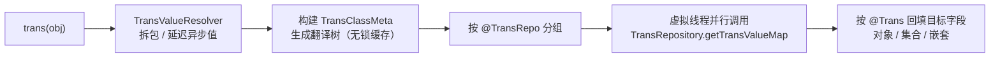

# easy-trans

<p align="center">
  <a href="https://github.com/orangewest/easy-trans">
    
  </a>
</p>

<p align="center">
  基于注解的 Java 数据翻译框架 —— 用一行注解把编码值（<code>sex=1</code>、<code>teacherId=2</code>）自动回填成展示值（<code>sexName="男"</code>），告别重复的查表赋值。
</p>

<p align="center">
  <a href="https://search.maven.org/artifact/io.github.orangewest/easy-trans-spring-start"></a>
  <a href="LICENSE"></a>
  
  
  
</p>

## 目录

- [简介](#简介)
- [为什么需要 easy-trans](#为什么需要-easy-trans)
- [特性](#特性)
- [环境要求](#环境要求)
- [快速开始](#快速开始)
- [核心设计](#核心设计)
- [注解与接口](#注解与接口)
- [使用详解](#使用详解)
  - [字典翻译 @DictTrans](#字典翻译-dicttrans)
  - [枚举翻译 @EnumTrans](#枚举翻译-enumtrans)
  - [集合与数组翻译](#集合与数组翻译)
  - [嵌套翻译](#嵌套翻译)
  - [递归嵌套 @TransNest](#递归嵌套-transnest)
  - [包装对象与异步/响应式](#包装对象与异步响应式)
  - [对象直接填充](#对象直接填充)
  - [自定义元注解](#自定义元注解)
  - [异常处理](#异常处理)
- [与 Spring Boot 集成](#与-spring-boot-集成)
- [可观测性（Micrometer）](#可观测性micrometer)
- [与 MyBatis / JPA 集成](#与-mybatis-jpa-集成)
- [GraalVM Native Image](#graalvm-native-image)
- [模块说明](#模块说明)
- [示例运行](#示例运行)
- [参与贡献](#参与贡献)
- [许可证](#许可证)

## 简介

一句话看懂它做什么 —— 声明式地把编码「翻译」成展示值：

```java
class UserDto {
    @TransRepo(using = TeacherTransRepository.class)
    Long teacherId = 2L;                          // 翻译前：只有编码
    @Trans(trans = "teacherId", key = "name")
    String teacherName;                            // 翻译前：null

    @DictTrans(group = "sex", trans = "sex")
    String sex = "1";
    String sexName;                                // 翻译前：null
}

new TransService().trans(user);
// 翻译后： teacherName = "老师2"， sexName = "男"
```

在典型的接口开发中，数据库只存储编码值：`sex=1`、`teacher_id=2`。把这些编码转换成前端可直接展示的 `sexName="男"`、`teacherName="老师2"`，往往充斥着大量重复的查表、赋值逻辑。

easy-trans 用注解把「翻译关系」声明在 DTO 上：框架在运行时读取这些声明，按数据源批量取数并回填到目标字段。核心模块 `easy-trans-core` 仅依赖 JDK，不含任何第三方运行时依赖，可独立使用，也可通过 `easy-trans-spring-start` 接入 Spring Boot。

- 原始值字段（`teacherId`）用 `@TransRepo` 声明数据源；
- 展示字段（`teacherName`）用 `@Trans` 声明「从哪个原始值取、取哪个属性」；
- 调用 `TransService.trans(obj)`，框架完成剩余工作。

## 为什么需要 easy-trans

接口开发里最常见的脏活之一：数据库只存编码（`sex=1`、`teacher_id=2`），前端却要展示 `男`、`老师2`。于是每个 DTO、每个接口里都塞满这样的重复代码：

```java
// ❌ 手写翻译：每个字段都要查、要判空、要赋值，且无法批量
UserDto user = userService.getById(id);
Teacher teacher = teacherMapper.selectById(user.getTeacherId());
user.setTeacherName(teacher == null ? null : teacher.getName());
DictItem sex = dictService.get("sex", user.getSex());
user.setSexName(sex == null ? null : sex.getLabel());
// ……还有城市、部门、枚举、字典项，越写越多，越难维护
```

easy-trans 把「编码 → 展示值」的关系声明在 DTO 上，框架在运行时按数据源批量取数、回填，业务代码只留一行 `trans()`：

```java
// ✅ 注解声明：翻译关系写在字段上，调用一行搞定
@TransRepo(using = TeacherTransRepository.class)
Long teacherId;
@Trans(trans = "teacherId", key = "name")
String teacherName;
@DictTrans(group = "sex", trans = "sex")
String sexName;

new TransService().trans(user);
```

不止是少写几行 —— 手写翻译很难做好的事，它顺手就解决了：

- **批量 & 并行**：一次 `trans()` 自动对同类原始值去重，不同数据源用虚拟线程并行查询。
- **集合 / 嵌套**：`List`、对象图、级联树（`省→市→县`）统一处理，内置对象图环检测。
- **可插拔**：数据库、字典、枚举、HTTP、缓存，都是同一个 `TransRepository` 接口。
- **零侵入**：翻译关系写在 DTO 上，不动你的 Service / DAO。

## 特性

- **注解驱动**：翻译关系写在字段上，业务代码零侵入。
- **数据源可插拔**：数据库、字典、HTTP、缓存均可接入，只需实现 `TransRepository` 一个接口。
- **并行取数 & 请求级去重**：同一对象内不同数据源并行查询（虚拟线程）；单次 `trans()` 调用内对「同仓库 + 同 repoName + 同注解属性 + 同源字段类型」的查询做请求级去重，减少重复查库。
- **多级嵌套（两套机制）**：① 同类**级联树**（`省→市→县`，按字段引用关系自动构建，内置环检测）；② `@TransNest` **递归翻译**嵌套对象 / 集合（如 `List<OrderDto>`、子 `AddressDto`），全图一次性批量翻译 + 身份环检测。
- **集合 / 数组翻译**：源或目标为 `List` / `Set` / 数组时，框架按元素批量翻译，保持顺序。
- **包装对象 & 异步/响应式**：`Result<T>`、`PageData<T>` 经 `TransValueResolver` 拆包；`CompletableFuture` / `Mono` / `Flux` 延迟到结果就绪后翻译（`easy-trans-core` 不静态引用 Reactor，保持零依赖）。
- **对象填充**：当目标字段类型与仓库返回类型一致时直接填入整个对象，否则按 `key` 提取属性。
- **可观测（通用测量总线）**：`easy-trans-core` 仅定义 `TransMetrics` 抽象接口，不依赖任何监控库；Spring 下自动桥接 Micrometer Observation（Timer + 链路追踪），亦可自定义后端（日志 / OpenTelemetry）。
- **零运行时依赖**：`easy-trans-core` 仅依赖 JDK，可嵌入任意项目，亦可用于 GraalVM Native Image。

## 环境要求

easy-trans 有两条并行的版本线：

| 版本线 | JDK | Spring Boot | 适用场景 |
| --- | --- | --- | --- |
| **2.x**（主线，当前 2.0.0） | JDK 25（构建需 JDK 25，运行需 JRE 25+） | Spring Boot 4.x（已验证 4.1.0） | 可升级 JDK 与 Spring 的新项目 |
| **1.x**（维护线） | JDK 8+ | Spring Boot 2.7.x | 仍停留在 JDK 8 / Spring Boot 2.7 的项目 |

- 主线 2.x 要求 **JDK 25 + Spring Boot 4**；若项目停留在 JDK 8 或 Spring Boot 2.7，请使用 1.x。
- `easy-trans-core` 始终保持零第三方依赖，可脱离 Spring 独立使用。
- **GraalVM Native Image**：需 Spring Boot 4 的 AOT + RuntimeHints，已在 `easy-trans-spring-start` 通过 `EasyTransRuntimeHints` 内置支持；构建使用 JDK 25 + GraalVM for JDK 25。

## 快速开始

### 1. 引入依赖

从 Maven Central 获取（coordinates 如下）；若需本地构建，克隆仓库后执行 `mvn clean install` 安装到本地仓库。

```xml
<dependency>
    <groupId>io.github.orangewest</groupId>
    <artifactId>easy-trans-spring-start</artifactId>
    <version>2.0.0</version>
</dependency>
```

若不使用 Spring，仅引入 core 即可：

```xml
<dependency>
    <groupId>io.github.orangewest</groupId>
    <artifactId>easy-trans-core</artifactId>
    <version>2.0.0</version>
</dependency>
```

### 2. 定义 DTO 上的翻译关系

```java
public class UserDto {
    // 原始值字段：声明数据源
    @TransRepo(using = TeacherTransRepository.class)
    private Long teacherId;

    // 展示字段：从 teacherId 取数，提取其 name 属性
    @Trans(trans = "teacherId", key = "name")
    private String teacherName;

    // getter / setter
}
```

### 3. 实现数据源

唯一需要自己实现的接口是 `TransRepository`：

```java
public class TeacherTransRepository implements TransRepository<Long, TeacherDto> {

    @Override
    public Map<Long, TeacherDto> getTransValueMap(List<Long> ids, TransContext ctx) {
        // 任意数据源：SQL、缓存、RPC……
        return teacherService.listByIds(ids).stream()
                .collect(Collectors.toMap(TeacherDto::getId, x -> x));
    }
}
```

`getTransValueMap` 的入参是本次需要翻译的**去重后的所有原始值**，返回 `原始值 -> 结果对象` 的映射，框架负责把结果写回每个目标字段。

### 4. 注册并执行翻译

**非 Spring 环境**：注册仓库后直接调用 `trans()`。执行器在首次翻译时按需创建（懒加载虚拟线程执行器），无需手动初始化。

```java
TransRepositoryFactory.register(new TeacherTransRepository());

UserDto user = new UserDto();
user.setTeacherId(2L);
new TransService().trans(user);

// user.getTeacherName() == "老师2"
```

**Spring 环境**：把仓库标 `@Component` 即可被自动注册，详见[与 Spring Boot 集成](#与-spring-boot-集成)。

### 执行器生命周期

默认执行器是一个虚拟线程池，在首次翻译时懒加载创建。

- 应用退出前，非 Spring 环境应调用 `TransService.close()` 关闭默认执行器（`TransService` 实现 `AutoCloseable`）。
- 在 Spring 中，`TransService` 作为 Bean 由容器管理，关闭时自动调用 `close()` 释放默认执行器，无需手动处理。
- 自定义执行器：非 Spring 环境用 `TransService.setExecutor(myExecutor)`；Spring 环境注册一个自定义的 `Executor` Bean（配合 `@ConditionalOnMissingBean`）覆盖默认执行器。

### 并行取数与查询合并

`TransService` 有两个可调节的开关，用于在不同场景下平衡吞吐与上下文安全：

- **`parallelRepoGroups`（默认 `true`）**：当对象包含 2 个以上仓库分组时，各组在虚拟线程上并行查询（`CompletableFuture.runAsync`）。并行会丢失调用线程的 `ThreadLocal` 上下文（JPA Session、Spring Security、MDC trace-id 等）。若你的 `getTransValueMap` 依赖这些上下文，请关闭并行：非 Spring 调 `setParallelRepoGroups(false)`；Spring 通过配置 `easy-trans.parallel-repo-groups=false`。
- **`repoCoalescing`（默认 `true`）**：单次 `trans()` 调用内，对「同一仓库 + 同一 repoName + 同一注解属性 + 同一源字段类型」的查询做请求级去重，仅查缺失的键；累积表随调用结束即丢弃，**不是**跨调用缓存。它假设仓库在单次调用内对同一语义查询是幂等的；若不满足，请关闭合并：非 Spring 调 `setRepoCoalescing(false)`。

## 核心设计

翻译过程可拆为四步：

1. **适配 trans**：`TransValueResolver` 拆 `Result` / `Page` 等包装对象；异步/响应式返回值（`CompletionStage` / `Mono` / `Flux`）延迟到值就绪后再翻译。
2. **解析元数据**：首次遇到该类时构建 `TransClassMeta`，按字段引用关系生成翻译树（无锁缓存）。
3. **分组并行取数 `doTrans`**：按 `@TransRepo` 分组，各组用虚拟线程并行调用对应的 `TransRepository`（并行开关见上文）。
4. **回填字段**：按 `@Trans` 把取到的值写回目标字段（支持对象 / 集合 / 嵌套）。

四个核心角色：

| 角色 | 职责 |
| --- | --- |
| `@Trans` | 标注在**目标字段**上，声明「从哪个源字段取数、提取哪个属性」。 |
| `@TransRepo` | 标注在**源字段**上，把源字段绑定到某个 `TransRepository`；可重复、可用在自定义注解上作为元注解。 |
| `TransRepository<T, R>` | 唯一需实现的接口，`getTransValueMap` 从任意数据源批量取数。 |
| `TransValueResolver` | 统一扩展点：拆 `Result`/`Page` 等包装对象，或处理 `CompletionStage`/`Mono`/`Flux` 等异步/响应式返回值（延迟翻译）。 |

翻译流程一目了然：


```mermaid
flowchart LR
    A["trans(obj)"] --> B["TransValueResolver\n拆包 / 延迟异步值"]
    B --> C["构建 TransClassMeta\n生成翻译树（无锁缓存）"]
    C --> D["按 @TransRepo 分组"]
    D --> E["虚拟线程并行调用\nTransRepository.getTransValueMap"]
    E --> F["按 @Trans 回填目标字段\n对象 / 集合 / 嵌套"]
```

## 注解与接口

```java
@Retention(RetentionPolicy.RUNTIME)
@Target({ElementType.FIELD, ElementType.ANNOTATION_TYPE})
public @interface Trans {
    String trans() default "";   // 源字段名（或仓库名）；作元注解时可由自定义注解自身声明
    String key() default "";     // 从结果对象中提取的属性，省略取目标字段名
    Class<? extends TransRepository<?, ?>> using() default None.class; // 直接指定仓库，强约束按 trans() 名匹配 @TransRepo

    interface None extends TransRepository<Object, Object> {}
}
```

```java
@Retention(RetentionPolicy.RUNTIME)
@Target({ElementType.FIELD, ElementType.ANNOTATION_TYPE, ElementType.TYPE})
@Repeatable(TransRepos.class)
public @interface TransRepo {
    String name() default "";    // 仓库名，省略用字段名
    Class<? extends TransRepository<?, ?>> using(); // 绑定的数据源（必填）
}
```

```java
public interface TransRepository<T, R> {
    Map<T, R> getTransValueMap(List<T> transValues, TransContext context);
}
```

`TransContext` 在**元数据解析阶段**一次性读取源注解属性（如 `@DictTrans` 的 `group`、`@DbTransRepo` 的 `entity`），运行时只读、不再反射，因此天然兼容 GraalVM Native Image：

```java
public interface TransContext {
    Object get(String attribute);
    <V> V get(String attribute, Class<V> type);
    String repoName();
    default Class<?> sourceType() { return null; } // 供「枚举即字典」推断枚举类
}
```

## 使用详解

### 字典翻译 @DictTrans

框架内置 `@DictTrans`（本质是 `@Trans(using = DictTransRepository.class)` 的元注解），标注在**目标字段**上，通过 `group` 区分不同字典，`trans` 指向持有原始 code 的源字段：

```java
private String sex;

@DictTrans(group = "sex", trans = "sex")
private String sexName;
```

`DictTransRepository` 由调用方提供 `DictLoader` 注入字典数据，在 Spring 环境中当容器存在 `DictLoader` Bean 时自动装配。`DictLoader` 是一个函数式接口：

```java
@FunctionalInterface
public interface DictLoader {
    Map<String, String> loadDict(String dictGroup); // 返回 code -> 展示值
}
```

### 枚举翻译 @EnumTrans

框架内置 `@EnumTrans`（本质是 `@Trans(using = EnumTransRepository.class)` 的元注解），用于「枚举即字典」。它有两种常见用法：

**用法一：源字段本身就是枚举对象**（枚举类从源字段类型自动推断，`key` 默认取 `label`）：

```java
public enum SexEnum {
    MALE(1, "男"), FEMALE(2, "女");
    private final int code;
    private final String label;
    // getters
}

private SexEnum sex;

@EnumTrans(trans = "sex")        // 默认 enumClass 从 sex 字段类型推断，key 默认 "label"
private String sexLabel;         // "男" / "女"
```

**用法二：源字段是 code（如 `int`）**（需显式指定 `enumClass` 与用于匹配的 `code` 字段）：

```java
private int sexCode;

@EnumTrans(trans = "sexCode", enumClass = SexEnum.class, code = "code")
private String sexLabel;
```

`EnumTransRepository` 在 Spring 环境中由框架无条件注册，无需手动声明。

### 集合与数组翻译

当源或目标为集合 / 数组时，框架按元素翻译，保持顺序：

```java
@TransRepo(using = TeacherTransRepository.class)
private List<Long> teacherIds;

@Trans(trans = "teacherIds", key = "name")
private List<String> teacherNames;  // ["老师1", "老师2"]
```

**源/目标字段解耦**：翻译以每个目标字段为单位独立进行。同一源字段上的多个目标（例如一个取 `name`、另一个取 `id`）各自独立翻译；源字段与目标字段的集合维度（一对一、一对多、多对一）无需一致。

### 嵌套翻译

框架按字段引用关系自动构建翻译树，支持多层级联。下例中 `areaId -> cityId -> provinceId` 形成链路：

```java
public class CityDto {
    @TransRepo(using = CityTransRepository.class)
    private Long areaId;

    @Trans(trans = "areaId", key = "name", using = CityTransRepository.class)
    private String areaName;

    @Trans(trans = "areaId", key = "pid", using = CityTransRepository.class)
    @TransRepo(using = CityTransRepository.class)
    private Long cityId;

    @Trans(trans = "cityId", key = "name")
    private String cityName;

    @Trans(trans = "cityId", key = "pid")
    private Long provinceId;

    @Trans(trans = "provinceId", key = "name", using = CityTransRepository.class)
    private String provinceName;
}
```

翻译 `areaId=7`（长沙市）后得到：`areaName=长沙县`、`cityId=2`、`cityName=长沙市`、`provinceId=1`、`provinceName=湖南省`。

链路依赖每一级的 `key` 都能在数据源中找到对应记录。若某级缺失（如 `pid` 指向不存在的 id），该级及后续层级字段保持 `null`——这是数据缺失的正常结果，不是框架缺陷。嵌套翻译内置对象图环检测（基于已访问对象集合），遇到自引用或循环对象图不会死循环。

### 递归嵌套 @TransNest

当 DTO 里嵌着另一个也需要翻译的 DTO（或其 `List` / `Set` / 数组）时，用 `@TransNest` 标记该字段即可。框架会收集整个对象图中**所有同类型的嵌套对象**，一次性批量翻译（保留批量 / 并行的优势），并以**身份（identity）**语义做环检测，遇到自引用或循环对象图不会死循环。

```java
class UserDto {
    @TransRepo(using = OrderTransRepository.class)
    private Long orderId;
    @Trans(trans = "orderId", key = "statusName")
    private String orderStatusName;          // UserDto 自身的翻译

    @TransNest
    private List<OrderDto> orders;           // 每个 OrderDto.statusName 自动被填
    @TransNest
    private AddressDto address;              // AddressDto.cityName 自动被填
}

class OrderDto {
    @TransRepo(using = StatusTransRepository.class)
    private Long statusId;
    @Trans(trans = "statusId", key = "name")
    private String statusName;
}
```

`java.*` 类型、`null` 与基本类型会被自动跳过。`@TransNest` 与上面的「级联翻译树」是**两套独立机制**：前者递归进入**嵌套对象 / 集合字段**（不同类之间），后者在**同类**中按字段引用链构建级联树。两者可叠加使用。

### 包装对象与异步/响应式

返回值是 `Result<T>`、`PageData<T>` 这类包装类型时，注册 `TransValueResolver` 拆包即可让翻译触达内部业务对象（与异步/响应式返回值的处理是同一个扩展点）：

```java
public class ResultResolver implements TransValueResolver {
    @Override
    public boolean supports(Class<?> type) {
        return Result.class.isAssignableFrom(type);
    }
    @Override
    public Object handle(Object value, Function<Object, Object> translator) {
        return translator.apply(((Result<?>) value).getData());
    }
}
```

非 Spring 环境：`TransValueResolverFactory.register(new ResultResolver())`。

**匹配顺序（`priority()`）**：多个解析器按 `priority()` **降序**匹配（数值越大越先尝试）。内置 `CompletionStageResolver` 使用 `Integer.MAX_VALUE` 排在最前，因此自定义解析器（默认 `priority() = 0`）仅在没有内置解析器命中该类型时才会被选用——适合处理框架未内置的包装 / 异步类型。Spring 下按 `@Component` 自动注册，可重写 `priority()` 调整顺序。

**异步 / 响应式**：框架内置 `CompletionStageResolver`；在 Spring 集成下，当 classpath 存在 Reactor 时，`ReactorTransResolver` 会自动注册，使 `Mono` / `Flux` 返回值在 `map` 阶段完成内部翻译。`easy-trans-core` 本身不静态引用 Reactor，保持零依赖。

### 对象直接填充

当目标字段类型与仓库返回类型一致时，框架填入整个对象；否则按 `key` 提取属性：

```java
@TransRepo(name = "teacherId1", using = TeacherTrans2Repository.class)
private Long teacherId;

@Trans(trans = "teacherId")             // 类型一致 -> 填入整个 TeacherDto
private TeacherDto teacher;

@Trans(trans = "teacherId", key = "name")
private String teacherName;             // 提取 name 属性
```

### 自定义元注解

`@TransRepo` 与 `@Trans` 都可作为元注解用在自定义注解上，把重复的声明收敛成语义化注解。前者绑定**数据源**，后者声明**翻译规则**。

**`@TransRepo` 元注解（绑定数据源）** —— 框架内置的 `@DictTrans`、`@EnumTrans` 即采用 `@Trans` 元注解（见上）；自定义数据源元注解同理：

```java
@TransRepo(using = TeacherTransRepository.class)
@Target(ElementType.FIELD)
@Retention(RetentionPolicy.RUNTIME)
public @interface TeacherTransRepo {
    String name() default "";
}
```

源字段上写 `@TeacherTransRepo` 即等价于 `@TransRepo(using = TeacherTransRepository.class)`。

**`@Trans` 元注解（声明翻译规则）** —— 把 `trans` / `key` / `using` 直接固化进自定义注解，字段上只需一行语义化声明：

```java
@Trans(trans = "teacherId", key = "name")
@Target(ElementType.FIELD)
@Retention(RetentionPolicy.RUNTIME)
public @interface TeacherName {
}
```

```java
@TeacherTransRepo
private Long teacherId;

@TeacherName                 // 等价于 @Trans(trans = "teacherId", key = "name")
private String teacherName;
```

若元 `@Trans` 未写 `trans` / `key`，框架会回退读取自定义注解自身声明的 `trans()` / `key()` 成员，使同一注解能按字段差异传参。自定义元注解声明的属性（如 `@DictTrans.group()`）会在解析阶段进入 `TransContext`，供仓库取用。

### 异常处理

翻译执行前，框架会为目标类构建一次元数据。若注解配置存在问题，构建阶段直接抛出 `TransException`（运行时异常），并附带类名与字段名：

- **引用悬空**：`@Trans(trans = "xxx")` 指向的源字段 `xxx` 既无同名 `@TransRepo`、也未通过 `@Trans(using = ...)` 指定仓库 —— `references translation repository 'xxx' which is not declared`。
- **字段不存在**：`@Trans(using = X, trans = "yyy")` 中 `yyy` 在类中不存在 —— `but no such field exists in class ...`。
- **仓库未注册**：翻译时 `@TransRepo` 指向的 `TransRepository` 未注册（未 `register(...)` 或 Spring 下未标 `@Component`）—— `TransRepository is not registered`。
- **循环引用**：嵌套翻译在元数据层面形成不可达的环（A 引用 B、B 又引用 A）—— 构建阶段抛出 `TransException`。注意：对象图层面的自引用/循环引用不会死循环，由运行时环检测安全跳过。

## 与 Spring Boot 集成

引入 `easy-trans-spring-start` 后，框架通过 Spring Boot 自动配置装配，无需手动初始化或注册：

```xml
<dependency>
    <groupId>io.github.orangewest</groupId>
    <artifactId>easy-trans-spring-start</artifactId>
    <version>2.0.0</version>
</dependency>
```

自动配置（`EasyTransAutoConfiguration`）负责：

- 创建并装配 `TransService`（`@ConditionalOnMissingBean` 可覆盖）；支持通过配置 `easy-trans.parallel-repo-groups` 调节并行开关。
- 扫描容器中的所有 `TransRepository`、`TransValueResolver`、`DictLoader` 实现并注册（标 `@Component` 即可，无需手动 `register`）；
- 注册 `@AutoTrans` 切面与 `TransUtil`。

具体装配项：
- `TransService`（`@ConditionalOnMissingBean`）
- `DictTransRepository`（仅在容器存在 `DictLoader` Bean 时）
- `EasyTransRegister`（`BeanPostProcessor`，自动注册 `@Component` 的仓库/解析器）
- `AutoTransAspect`
- `TransUtil`
- `EnumTransRepository`（无条件注册）
- `ReactorTransResolver`（仅在 classpath 存在 `reactor.core.publisher.Mono` 时）
- `TransMetricsMicrometer`（仅在 classpath 存在 `io.micrometer.observation.ObservationRegistry` 且容器有 `ObservationRegistry` 时；否则退化为 `NoopTransMetrics`）

### 在方法上自动翻译

在返回结果的方法上标注 `@AutoTrans`，切面会拦截返回值并完成翻译：

```java
@GetMapping("/query")
@AutoTrans
public Result<PageData<BizDTO>> page(Query query) {
    return Result.ok(bizService.page(query));
}
```

- **同步返回**：直接对返回值（如 `Result`、`Page` 等包装对象）翻译；
- **异步 / 响应式返回**：返回 `CompletableFuture` / `Mono` / `Flux` 时，切面调用 `TransUtil.trans`，在结果就绪后再翻译（而非对包装对象本身翻译，后者会静默失效）。

### 手动翻译

```java
// 自动处理同步 / 异步 / 响应式
return TransUtil.trans(bizService.page(query));

// 对已就绪对象做同步翻译
TransUtil.trans(bizDto);
```

## 可观测性（指标 & 链路追踪）

`easy-trans-core` **不依赖任何监控库**，只定义一套**通用测量总线** `TransMetrics`：引擎只负责「按 operation 发出测量点 + 携带语义上下文（`TransMetricContext`）」，具体如何呈现（Timer / Counter / Tracing Span）完全交给后端实现。未接入任何后端时退化为 `NoopTransMetrics`，零开销、无 NPE。

### 测量点（`TransMetricsOperations`）

引擎在翻译过程中发出两类测量点，并通过 `parent` 指针形成父子调用树——`translate` 为根 Span，`repository` 为其直接子 Span：

| operation | 含义 |
| --- | --- |
| `translate` | 单次 `trans()` 调用总耗时（根 Span） |
| `repository` | 单个仓库 `getTransValueMap` 查询耗时（`repo` 为 `@TransRepo` 名或 `@Trans` 源字段名） |

### 语义上下文（`TransMetricContext`）

每个测量点携带结构化的 **low / high cardinality** 维度，从根本上规避高基数爆炸：

- **low cardinality（默认进 tag）**：`operation`、`repo`（`repoName`）、`depth`（嵌套层级）、`success`（是否异常）。
- **high cardinality（默认不进 tag）**：`targetClass`、`repositoryClass`；如需下钻，后端可在 `Span#setAttribute(key, value)` 中显式补充（按 high-cardinality 处理）。

### Spring 自动桥接 Micrometer

`micrometer-core` 在 `easy-trans-spring-start` 中是 **optional** 依赖。当 classpath 存在 Micrometer Observation 且容器中有 `ObservationRegistry` 时，自动配置把 `TransMetricsMicrometer` 注入 `TransMetricsCollector`，无需任何代码：

- 借助 Spring Boot 的 `TimerObservationHandler`，`translate` / `repository` 自动以 Timer 形式暴露为 `easytrans.translate` / `easytrans.repository`（携带上述低基数 tag）。
- 若运行环境存在 Tracing 基础设施（如 OpenTelemetry），Observation 天然具备链路追踪能力。

```bash
# actuator 暴露指标后查看
GET /actuator/metrics/easytrans.translate
GET /actuator/metrics/easytrans.repository
GET /actuator/prometheus
```

### 自定义后端

实现 `TransMetrics` 后注册即可，core 不依赖任何监控库：

```java
// 非 Spring：静态注入
TransMetricsCollector.set(myMetrics);

// Spring：声明为 Bean 即被自动装配（@ConditionalOnMissingBean，可被你的实现覆盖）
@Bean
public TransMetrics transMetrics() {
    return new MyMetrics();
}
```

`TransMetrics` 契约：

```java
public interface TransMetrics {
    /** 开启一段计时，context 携带 operation + 语义维度；返回 Span 句柄。 */
    Span startSpan(String operation, TransMetricContext context);

    interface Span {
        void setAttribute(String key, String value); // 补充 high-cardinality 维度
        void recordException(Throwable t);           // 标记异常（success=false）
        void end();                                   // 结束计时并提交
    }
}
```

新增埋点无需改动接口或引擎：只需在 `TransMetricsOperations` 增加常量，再经 `TransMetricsCollector.get().startSpan(...)` 发出即可。

## 与 MyBatis / JPA 集成

框架不绑定任何 ORM。完整可运行示例见 `easy-trans-demo` 下的 `easy-trans-demo-jpa` 与 `easy-trans-demo-mybatis` 子模块。落地路径为：

1. 定义实体基类 `BaseEntity`（承载主键 `id`）；
2. 定义自定义 `@DbTransRepo` 元注解（声明要查哪个实体类）；
3. 定义通用 `DbTransRepository`，通过 `TransDriver` 按 id 批量查库；
4. 为 MyBatis / JPA 各提供一个 `TransDriver` 实现。

```java
// 源字段：绑定通用仓库 + 声明实体
@DbTransRepo(entity = Teacher.class)
private Long teacherId;

@Trans(trans = "teacherId")             // 类型一致 -> 填入整个 Teacher
private Teacher teacher;

@Trans(trans = "teacherId", key = "name")
private String teacherName;
```

通用仓库在运行期通过 `TransContext` 反射地拿到 `entity`：

```java
@Component
public class DbTransRepository implements TransRepository<Long, BaseEntity> {
    @Autowired
    private TransDriver transDriver;

    @Override
    public Map<Long, BaseEntity> getTransValueMap(List<Long> ids, TransContext ctx) {
        Class<?> raw = ctx.get("entity", Class.class);
        if (raw == null || BaseEntity.class.equals(raw)) {
            return Map.of();
        }
        Class<? extends BaseEntity> entity = (Class<? extends BaseEntity>) raw;
        return transDriver.findByIds(ids, entity).stream()
                .collect(Collectors.toMap(BaseEntity::getId, x -> x));
    }
}
```

`TransDriver` 把「按 id 批量查某个实体」这件与 ORM 相关的事抽离出来：

```java
public interface TransDriver {
    List<? extends BaseEntity> findByIds(List<? extends Serializable> ids,
                                         Class<? extends BaseEntity> targetClass);
}
```

MyBatis-Plus（基于 `BaseMapper.selectBatchIds`）与 JPA（基于 `EntityManager` 动态 JPQL）的 `TransDriver` 实现见 demo 子模块。在 Spring 环境下，`DbTransRepository` 与具体 `TransDriver` 只要标注 `@Component` 即被自动注册。

### Native Image 注意事项

`@DbTransRepo` 是 `@TransRepo` 元注解的自定义注解，`EasyTransRuntimeHints` 会在 AOT 阶段自动识别（递归扫描元注解）并注册反射元数据，因此 native 构建无需手写 `reflect-config`——只要你的自定义注解使用了 `@TransRepo` 元注解，即可被自动覆盖。

## GraalVM Native Image

`EasyTransRuntimeHints`（包 `io.github.orangewest.trans.spring.aot`）实现了 `RuntimeHintsRegistrar`，依赖 Spring Boot AOT / Spring Framework AOT hint API。它在 AOT 阶段扫描类路径上字段级标注 `@Trans` / `@TransRepo` / `@DictTrans` / `@TransRepos` 的 DTO，注册字段读写 hint 与注解方法调用 hint，并支持自定义元注解的递归识别。

可通过系统属性 `easy-trans.aot.base-packages` 收敛扫描范围，减少 AOT 扫描开销。

**结果类型自动提示（2.0.0+）**：`readValueByKey` 反射式读取仓库结果对象的字段（如实体 key 字段，或 `@EnumTrans` 枚举常量的 label 字段）。AOT 阶段 `EasyTransRuntimeHints` 会自动为以下类型注册 `ACCESS_DECLARED_FIELDS` hint：

- **仓库结果类型**：经由 `@TransRepo(using = ...)` 或 `@Trans(using = ...)`，其 `TransRepository` 子类泛型 `R`（JPA 实体、自定义值对象）被自动提示；
- **`@EnumTrans(enumClass = ...)` 枚举类**被自动提示（`label` / `code` 公共字段）；
- **运行时按名注册的仓库**（非 `using` 声明）无法在静态期发现，需用户手动补充 hint。

**缩小扫描范围**：设置 JVM 系统属性 `-Deasy-trans.aot.base-packages=com.foo,com.bar`，将 AOT 扫描限制在特定包前缀（逗号分隔），降低大项目的构建期开销；否则扫描整个 classpath。

## 模块说明

| 模块 | 职责 |
| --- | --- |
| `easy-trans-core` | 框架实现。纯 Java，无外部运行时依赖。包根：`io.github.orangewest.trans`。 |
| `easy-trans-spring-start` | Spring Boot 4.1.0 自动配置，把 core 接入 Spring 容器；提供 GraalVM Native Image 支持（`EasyTransRuntimeHints`）。 |
| `easy-trans-demo` | `pom` 聚合模块（本身不发布），下辖 5 个示例子模块，用于验证翻译端到端效果及作为 native-image 构建目标： |
| &nbsp;&nbsp;- `easy-trans-demo-aot` | AOT / GraalVM native 验证示例。 |
| &nbsp;&nbsp;- `easy-trans-demo-webflux` | WebFlux（Reactor）响应式翻译示例。 |
| &nbsp;&nbsp;- `easy-trans-demo-actuator` | 接入 `spring-boot-starter-actuator` + `micrometer-registry-prometheus`，验证翻译指标经 `/actuator/metrics`、`/actuator/prometheus` 暴露；含 `native` profile。 |
| &nbsp;&nbsp;- `easy-trans-demo-mybatis` | MyBatis 数据源集成示例。 |
| &nbsp;&nbsp;- `easy-trans-demo-jpa` | JPA 数据源集成示例。 |

## 示例运行

各 demo 子模块均为 Spring Boot 应用，直接运行主类即可：

```bash
mvn -pl easy-trans-demo-mybatis spring-boot:run
mvn -pl easy-trans-demo-jpa spring-boot:run
mvn -pl easy-trans-demo-webflux spring-boot:run
mvn -pl easy-trans-demo-actuator spring-boot:run   # 随后访问 GET /actuator/metrics/easytrans.translate、/actuator/prometheus
mvn -pl easy-trans-demo-aot spring-boot:run
```

**Native Image 构建**：仅 `aot`、`webflux`、`actuator` 三个 demo 提供 `native` profile（`mybatis` 与 `jpa` 无）：

```bash
mvn -pl easy-trans-demo-aot -Pnative package      # 产物 ./target/easy-trans-demo-aot
mvn -pl easy-trans-demo-webflux -Pnative package
mvn -pl easy-trans-demo-actuator -Pnative package
```

## 参与贡献

欢迎 Issue 与 Pull Request：

- **提问题 / 提需求**：在 [Issues](https://github.com/orangewest/easy-trans/issues) 描述场景与复现步骤。
- **提交代码**：Fork 仓库 → 新建分支 → `mvn clean install` 确保通过 → 发起 PR。
- **本地构建**：需 JDK 25。根目录构建与测试：

  ```bash
  mvn clean install
  mvn test
  ```

  单模块构建 / 单测试类：

  ```bash
  mvn -pl easy-trans-core clean install
  mvn -pl easy-trans-core test -Dtest=TransServiceTest
  ```

## 许可证

[Apache 2.0](LICENSE) © orangewest
